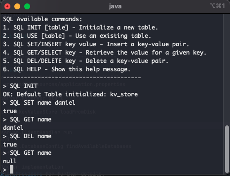

# KvDB - Key-Value Database 

---

A Redis-like distributed key-value store implemented in Java.

This project provides a lightweight, in-memory database with disk persistence options, as well as SQL persistence via simple CLI commands.
Supports both client-server architecture & interactive SQL and key-value command-line interfaces.

--- 

## CLI Preview


## Usage

### Prerequisites
- Java 11 or higher
- Maven
- PostgreSQL (optional, for SQL persistence)

### Sever to Server Communication
- The server uses a simple TCP socket for communication.
- i.e. `nc localhost 6379` will connect to the server.

### Starting the Server and Client CLI

Make the scripts executable:
```bash
chmod +x scripts/run_server.sh scripts/run_client.sh
```

Open up a terminal & start the Server
```bash
./scripts/run_server.sh
```

Open up another terminal & start the KvClient

```bash
./scripts/run_client.sh
```

### Basic CLI Commands

#### In-Memory Store Operations

- `SET key value` - Set key to hold string value
- `GET key` - Get the value of key
- `DEL key` - Delete one or more keys
- `EXISTS key` - Check if key(s) exist
- `ALL` - Get all key-value pairs
- `CLEAR` - Remove all keys from store and disk
- `SAVE` - Save the current state to disk

#### SQL Commands

- `SQL INIT [table_name]` - Initialize a new table (default if no name given)
- `SQL USE [table_name]` - Switch to an existing table
- `SQL GET/SELECT [key]` - Retrieve value for a given key
- `SQL SET/INSERT [key] [value]` - Store a key-value pair
- `SQL DEL/DELETE [key]` - Remove a key-value pair
- `SQL CLEAR/DROP` - Remove all entries from the current table
- `SQL PING` - Check connection to database
- `SQL HELP/INFO` - Display help message

#### Other Commands
- `PING` - Test connection
- `HELP` - Show help message
- `EXIT` - Exit the client

--- 

## Configuration

### Persistence Options

#### File-based Persistence

The system supports file-based persistence with options configured in `application.properties`:
```properties
kvdb.persistence.filepath=data/kvstore.dat
kvdb.persistence.filetype=dat
kvdb.persistence.enableAutoFlush=true
kvdb.persistence.autoFlushInterval=2
```

#### PostgreSQL Persistence

SQL commands leverage PostgreSQL for persistent storage. Configure your database connection in `application.properties`:
```properties
kvdb.database.default.url=jdbc:postgresql://localhost:5432/kvdb
kvdb.database.default.driver=org.postgresql.Driver
kvdb.database.default.username=yourusername
kvdb.database.default.password=yourpassword
kvdb.database.default.table=kv_store
```

### Server Configuration
The server can be configured via `application.properties`:
```properties
kvdb.server.port=6379
kvdb.server.host=localhost
```

--- 

# License
This project is licensed under the MIT License.
