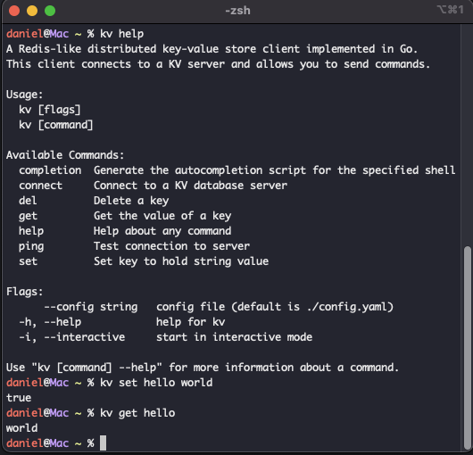

# KV CLI

KV CLI is a command-line client for interacting with kvdb cluster from any shell without starting up the java cli app. It allows users to easily connect to the coordinator server and perform various operations such as setting, retrieving, and deleting key-value pairs.

---

## Features

- Connect to a kvdb cluster using configurable host and port.
- Perform key-value operations such as `SET`, `GET`, `DEL`, `EXISTS`, and more.
- Interactive CLI mode for seamless command execution.
- Support for configuration via a YAML file or command-line flags.

---

## Preview


---

## Prerequisites
- Go 1.18 or later installed on your machine.
- Access to a running kvdb cluster with a coordinator server.


## Usage

To install and run KV CLI, you can use the following command:

1. build the project from this dirctory:
```bash
go build -o kv

# if you have GOPATH set up, skip step 2 and just do:
go install
```

2. move the binary to a directory in your PATH:
```bash
# for unix:
mv kv /usr/local/bin/

# for windows:
move kv.exe C:\Windows\System32\
```
3. run kv command anywhere you want:
```bash
# interactive mode
kv connect --host localhost --port 7000

# normal mode
kv set name daniel
```

